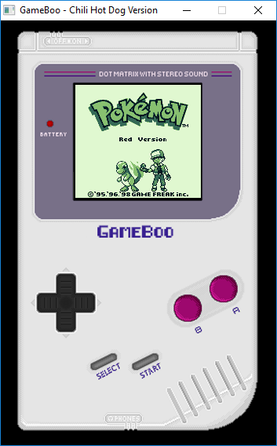
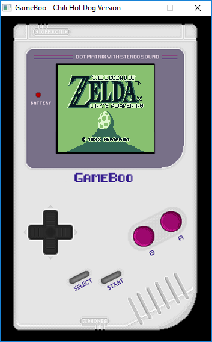
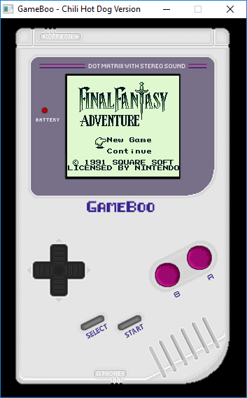
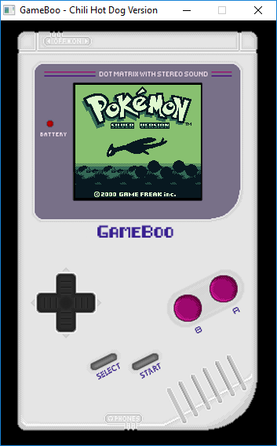
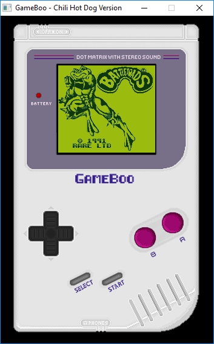
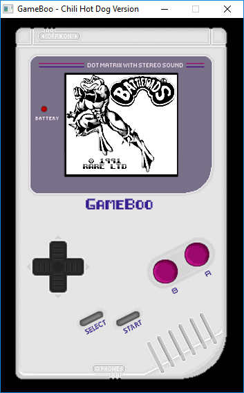
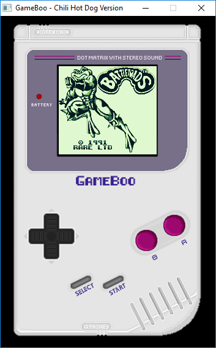
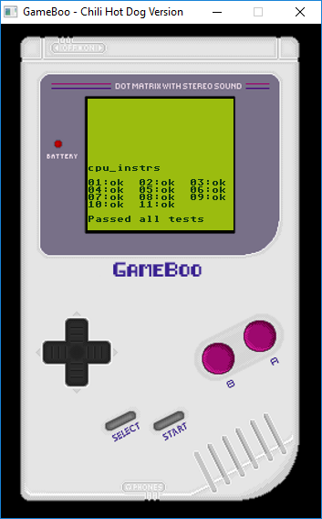

# GameBoo
```bash

        GGGGGGGGGGGGG                                                              
     GGG::::::::::::G                                                              
   GG:::::::::::::::G                                                              
  G:::::GGGGGGGG::::G                                                              
 G:::::G       GGGGGG  aaaaaaaaaaaaa      mmmmmmm    mmmmmmm       eeeeeeeeeeee    
G:::::G                a::::::::::::a   mm:::::::m  m:::::::mm   ee::::::::::::ee  
G:::::G                aaaaaaaaa:::::a m::::::::::mm::::::::::m e::::::eeeee:::::ee
G:::::G    GGGGGGGGGG           a::::a m::::::::::::::::::::::me::::::e     e:::::e
G:::::G    G::::::::G    aaaaaaa:::::a m:::::mmm::::::mmm:::::me:::::::eeeee::::::e
G:::::G    GGGGG::::G  aa::::::::::::a m::::m   m::::m   m::::me:::::::::::::::::e 
G:::::G        G::::G a::::aaaa::::::a m::::m   m::::m   m::::me::::::eeeeeeeeeee  
 G:::::G       G::::Ga::::a    a:::::a m::::m   m::::m   m::::me:::::::e           
  G:::::GGGGGGGG::::Ga::::a    a:::::a m::::m   m::::m   m::::me::::::::e          
   GG:::::::::::::::Ga:::::aaaa::::::a m::::m   m::::m   m::::m e::::::::eeeeeeee  
     GGG::::::GGG:::G a::::::::::aa:::am::::m   m::::m   m::::m  ee:::::::::::::e  
        GGGGGG   GGGG  aaaaaaaaaa  aaaammmmmm   mmmmmm   mmmmmm    eeeeeeeeeeeeee  
                                                                                   
 .-.
(o o) boo!
| O \
 \   \
  `~~~'

  Programmed by Julien Magnin (MS-DOS1999)
  Sound Emulation programmed by blargg
  Chiptune used for intro and file selection composed by Kid Zan
  Original Gameboy pixel art by ENSELLITIS
 ```

GameBoo is a Windows Nintendo GameBoy Color emulator written in C++/C/SFML/SDL.
The emulator can run the majority of GB games.



## Installation

Download the [latest release](https://github.com/MS-DOS1999/GameBoo/releases/tag/V3-Chili_Hot_Dog) of GameBoo from the releases page.

### Building from source

Download or clone this repo, and run:
```sh
git clone https://github.com/MS-DOS1999/GameBoo.git
cd GameBoo
compile.bat
```
You need G++ MinGW
And CSFML, SDL 1.2 lib

GameBoo is compatible only on Windows

## Usage

Just launch GameBoo.exe and select your favorite game

Other options:

  You can go in CONFIG/ and change values in config.txt

## Joypad/Input
<kbd>Z</kbd> - Up<br/>
<kbd>Q</kbd> - Left<br/>
<kbd>S</kbd> - Down<br/>
<kbd>D</kbd> - Right<br/>
<kbd>SpaceBar</kbd> - Select<br/>
<kbd>A</kbd> - Start<br/>
<kbd>O</kbd> - A<br/>
<kbd>K</kbd> - B<br/>
<kbd>Esc</kbd> - Quit Emulator<br/>

## Filter/Lcd Colors

You can choose different filter like Original Gameboy, Gameboy Pocket, Used Gameboy.



### Saving 
If the loaded rom supports battery a `<rom-name>.sav` (e.g. `pokemonRed.sav`) file will be created at Emulator exit.

## Testing
GameBoo currently passes all of the tests in Blargg's `cpu_instrs` test rom.



## Resources
Resources were used to understand and test the GameBoy hardware. Some of these include:
* <http://www.codeslinger.co.uk/pages/projects/gameboy/files/GB.pdf>
* <http://www.codeslinger.co.uk/pages/projects/gameboy/beginning.html>
* <http://www.pastraiser.com/cpu/gameboy/gameboy_opcodes.html>
* <https://gekkio.fi/files/gb-docs/gbctr.pdf>
* <http://gbdev.gg8.se/wiki/articles/Pan_Docs>
* <https://github.com/Humpheh/goboy>